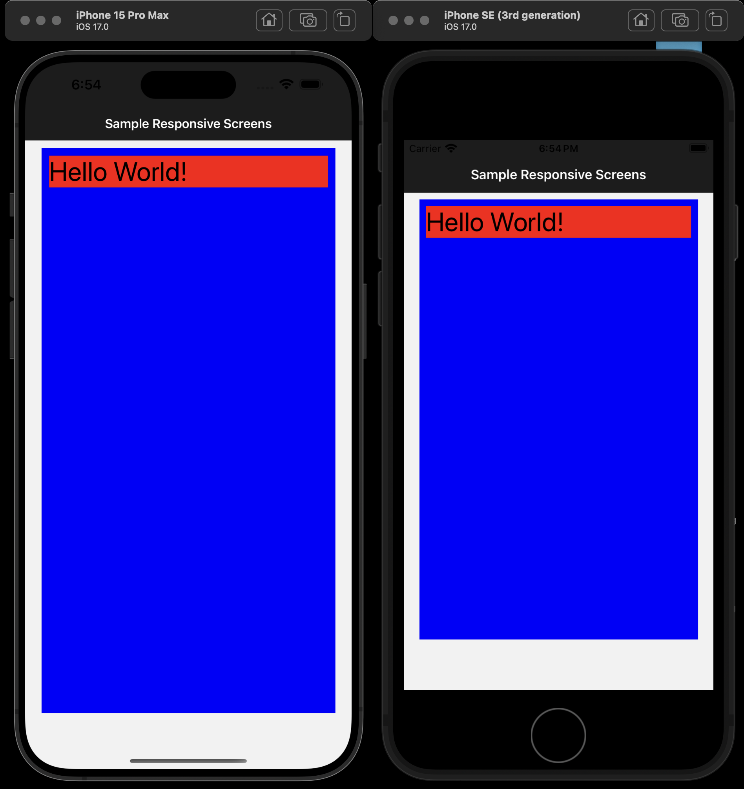

# 📱 react-native-responsive-sizes

## ⚙️ Description

Simple & lightweight react-native package to help you make your mobile app look terrific on every screen size. You may use the following functions to make your app more responsive.

| Function Name                         | Input                                                                         | Output                                                          | Example                                                                                                                                                                                                                           |
| ------------------------------------- | ----------------------------------------------------------------------------- | --------------------------------------------------------------- | --------------------------------------------------------------------------------------------------------------------------------------------------------------------------------------------------------------------------------- |
| **MOST POPULAR:** `responsive.size()` | number of pixels                                                              | number of pixels proportional to screen's height/width          | If you use `responsive.size(10)` then you will receive 10 pixels on iPhone 14 Pro, but slightly different number of pixels for other screen sizes, such as 8 pixels on a smaller iPhone SE or 12 pixels on a larger iPhone 12 Max |
| `responsive.width()`                  | number from 0-100, which corresponds to the percentage of the screen's width  | number of pixels equal to the percentage of the screen's width  | If you use `responsive.width(50)` then you will receive a number of pixels equal to 50% of the screen's width                                                                                                                     |
| `responsive.height()`                 | number from 0-100, which corresponds to the percentage of the screen's height | number of pixels equal to the percentage of the screen's height | If you use `responsive.height(50)` then you will receive a number of pixels equal to 50% of the screen's height                                                                                                                   |
| `responsive.fontSize()`               | font size number                                                              | font size that's more proportional to the size of the screen    | If you pass it `responsive.fontSize(32)` then you will receive a 32-point font-size on an iPhone 14 Pro, but slightly smaller font-sizes on smaller devices                                                                       |

## ⚙️ Examples

- Please see the [`sample.tsx`](https://github.com/react-native-responsive-sizes/react-native-responsive-sizes/blob/main/sample.tsx) file for a sample implementation, which is what was used for creating the screenshot below.

- Notice how in the screenshot below, the margin between the red and blue boxes looks perfectly proportional on all screen sizes. This is because the margin is set to `responsive.size(10)` which means that the margin will be 10 pixels on an iPhone 14 Pro, but slightly fewer pixels on a smaller screen, such as an iPhone SE.

